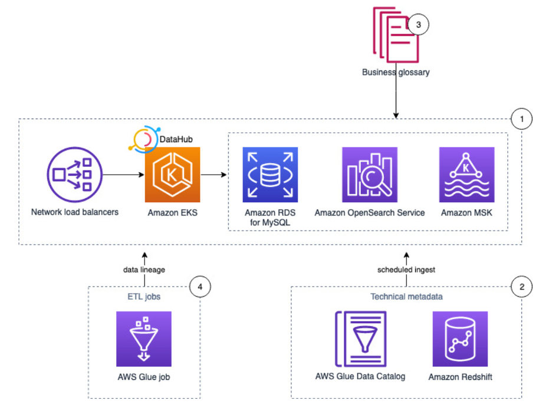

# Data Discovery
Many organizations treat data like an organizational asset, meaning it is no longer the property of individual departments. You want to analyze all types of data to drive actionable insights, be prepared for the unexpected, create new revenue streams, improve customer experience, and increase operational efficiencies.

The data discovery process consists of a number of interactive sessions with various stakeholders within an organization. Sometimes this starts with an initial session to identify new ways to extract value from your data, while at other times, it could be with a specific use-case around what you want to do. You can go straight into identifying key people and diving deep to gather the information that is need in order to determine your best possible solution.

In either case, the end goal is to maximize the value you get from the data and identify appropriate next steps. This includes how you plan to consume data, what data sources you have and how to ingest that data, and then potentially what types of transformations you may need for the data.

The common issue that can hold you back from maximizing the value of your data is the variety of data silos within your organization. Silos can prevent you from extracting maximum value from all your data with the greatest flexibility. Data warehouses can help with this to a point, but often only a small portion of raw data is bought into the data warehouse. Organizations often end up with multiple data warehouses, so you can still have these silos. There are a number of modern approaches to enterprise-wide analytics that can help solve this – such as data lakes, modern data architectures, and data mesh. If you are not already exploring these modern approaches, this is a good opportunity to learn more about these architectures in the following sections.

Another common issue is whether you can benefit from increasing the velocity at which you ingest and process your data. Many organizations still have a predominantly batch-oriented strategy to processing the data, where a majority of your data is processed on a daily schedule. You can ask yourself questions such as ‘How can we benefit if we have access to more up-to-date data?” AWS can help you explore options for ingesting streaming data, and for processing data in micro-batches or employ stream processing.

If you have previously explored streaming options in the past, you might have been concerned about the complexity of some of these solutions, but there are many AWS-managed solutions for streaming that significantly reduces much of this complexity.

::: tip What is Data Discovery

The process of finding and understanding relevant data sources within an organization and the relationships between them
:::

In general, data discovery consists of five steps:

### 1.  Define the business value 

##### This is the first step in data discovery where you define the business value or opportunity by conducting interactive sessions. Here are a few example questions to define the business opportunity.
- What insights are you getting from the data?
- How would getting insight into data provide value to the business?
- Are you looking to create a new revenue stream from your data?
- What are challenges with your current approach and tool? 
- What are you not providing to your customers that you would like to provide?
- Who is the executive level stakeholder for this effort?
- Example-specific use case questions:
- How does data define your customer acquisition strategy?
- Would your business benefit from exploring modern approaches to managing fraud detection, predictive maintenance, customer 360, IoT, clickstream, operational analytics, root-cause analysis to reduce mean time to detection and mean time to recovery?
- How are you continually innovating on behalf of your customers and improving their user experience?

### 2. Identify your user personas 

In this step, you focus on your data consumers, such as business analysts, data engineers, data analysts, and data scientists. Once you have developed your user personas, enable them for purpose-built analytics and machine learning. 

- Here are few example questions to identify your data consumers.
- Who are the end users? 
- What insights are you currently getting from your data?
- What insights are on your roadmap?
- Do you have a multi-tenant data model?
- What are the different consumption models?
  - Which tool or interface do your data consumers use?
  - How real time does the data need to be for this use case (for example, near real time, every 15 minutes, hourly, daily)? 
  - What is the total number of consumers for this consumption model?
  - What is the peak concurrency?

### 3. Identify your data sources

In this step, you focus on your data sources and tools to bring that data into the data platform. This allows you to perform comprehensive analytics and machine learning from a wide variety of data from various data sources.

Data types and sources

Table 3: Typical data sources in an organization
| Data type            | Example data sources                                                                                                       |
| -------------------- | -------------------------------------------------------------------------------------------------------------------------- |
| Structured data      | ERP applications, CRM applications, CMS applications, SaaS applications, SAP applications, LOB applications, SQL databases |
| Semi-structured data | Web applications, NoSQL databases, EDI, CSV, XML, JSON documents                                                           |
| Unstructured data    | Video files, audio files, images, IoT data, sensor data, invoices                                                          |
| Batch                | Internal applications generate structured data at regularly defined schedules                                              |
| Streaming data       | Sensors, social media, video streams, IoT devices, mobile devices generating semi-structured and unstructured data streams |

Here are a few example questions to identify your data consumers.

::: tip What questions do I ask during Data Discovery
  1. Who are the key stakeholders and data owners?
  2. Which formats and types of data are available?
  3. How will the data be secured and accessed?
:::

- How many data sources do you have to support?
  - Where and how is the data generated?
  - What are the different types of your data? (for example, structured, semi-structured, unstructured, batch, streaming)
  - What are the different formats of your data? (for example, JSON, CSV, FHIR)
  - Is your data originating from on premises, a third-party vendor, or the cloud?
  - Is the data source streaming, batch, or micro-batch?
  - What is the rate and volume of ingestion?
  - What is the ingestion interface (for example, API, SFTP, Amazon S3, AWS Marketplace)
- How does your team on-board new data sources?

### 4. Define your data storage, catalog, and data access needs

In this step, you focus on your data storage, data cataloging, security, compliance, and data access requirements.

Here are few example questions to identify your data storage and data access requirements. 

- What data stores do you have?
- What is the purpose of each data store?
- Why that storage method? (for example, files, SQL, NoSQL, data warehouse)
- How do you currently organize your data? (for example, data tiering, partition)
- How much data are you storing now, and how much do you expect to be storing in the future, for example, 18 months from now?
- How do you manage data governance? 
- What data regulatory and governance compliance do you face?
- What is your disaster recovery (DR) strategy?

### 5. Define your data processing requirements

In this step, you focus on your data processing requirements.

Here are few example questions to identify your data processing requirements. 

- Do you have to transform or enrich the data before you consume it?
- What tools do you use for transforming your data?
- Do you have a visual editor for the transformation code? 
- What is your frequency of data transformation? (for example, real time, micro-batching, overnight batch) 
- Are there any constraints with your current tool of choice?

::: tip What steps are involved in the Data Discovery Phase
  1. Identify key stakeholders and data sources across the organization.
  2. Ingest and explore sample data to understand data types and structures.
  3. Discover existing data types and formats.
:::

---

### Define Business Value
Conduct data discovery kick-off workshops with stakeholders to understand business goals, prioritize use cases, and identify potential data sources. 

::: info WHAT IS INFORMATION

### **Information is data that has been converted into a meaningful and useful context.**

:::

#### The following are example questions that define the business opportunity:

- How would getting insight into data provide value to the business?
- Are you looking to create a new revenue stream from your data?
- What are the challenges with your current approach and tool? 
- Would your business benefit from managing fraud detection, predictive maintenance, and root-cause analysis to reduce mean time to detection and mean time to recovery?
- How are you continually innovating on behalf of your customers and improving their user experience?

### Identify Your Data Consumers
Conduct interactive sessions with various stakeholders within an organization such as data scientists and analysts.

#### The following example questions can help identify your data consumers:

- Who are the end users (for example, business analysts, data engineers, data analysts, or data scientists)? 
- Which insights are you currently getting from your data?
- Which insights are on your roadmap?
- What are the different consumption models?
- Which tool or interface do your data consumers use?
- How real time does the data need to be for this use case (for example, near real time, every 15 minutes, hourly, or daily)? 
- What is the total number of consumers for this consumption model?
- What is the peak concurrency?

### Identify Your Data Sources
Research the different internal and external sources where data is generated and stored. This includes databases, applications, and files. 

#### Data can be categorized along three lines: data type, data source, and ingest mode. 
| Data types           | Example data types                                                              |
| -------------------- | ------------------------------------------------------------------------------- |
| Structured data      | Relational databases, spreadsheets, CSV files, XML                              |
| Semi-structured data | Non-relational databases, JSON, Log files, XML with attributes, IoT sensor data |
| Unstructured data    | Text documents, images, audio files, video files                                |

| Data sources                      | Example data sources                                                         |
| --------------------------------- | ---------------------------------------------------------------------------- |
| Databases                         | CRM applications, ERP applications, CMS applications                         |
| Files                             | On-premises file servers, document libraries, archives                       |
| Logs                              | Application logs, device logs                                                |
| IoT devices                       | Sensor data, device metadata, time-series data                               |
| Mobile devices                    | Social media, messaging apps                                                 |
| Video                             | Media and entertainment services, surveillance cameras, video libraries      |
| Software as a service (SaaS) apps | User activity logs, transactional data, marketing analytics, e-commerce data |
| Datasets                          | Demographic data, weather data, geospatial mapping, transportation data      |

| Ingest modes | Example ingest modes                                                           |
| ------------ | ------------------------------------------------------------------------------ |
| Streaming    | Sensors, social media platforms, media and entertainment services, IoT devices |
| Micro-batch  | Sensors, website logs, graphics and video rendering                            |
| Batch        | Medical imagery, genomic data, financial records, usage data                   |

#### The following example questions can help identify your data types,  data sources, and ingest modes:

- How many data sources do you have to support?
- Where and how is the data generated?
- What are the different types of data? 
- What are the different formats of data? 
- Is your data originating from on premises, a third-party vendor, or the cloud?
- Is the data source streaming, batch, or micro-batch?
- What is the velocity and volume of ingestion?
- What is the ingestion interface? 
- How does your team onboard new data sources?

### Define Your Storage, Catalog, and Data Access Needs
Determine the best storage for specific data types. Assess data quality to determine processing needs. Catalog and register details about data sources.

#### The following are example questions to identify your data storage and data access requirements:

- Which data stores do you have?
- What is the purpose of each data store?
- Why are you using that storage method?  (for example, files, SQL, NoSQL, or a data warehouse)
- How do you currently organize your data? (for example, data tiering or partition)
- How much data are you storing now, and how much do you expect to store in the future? (for example, 18 months from now)
- How do you manage data governance? 
- Which regulatory and governance compliance standards are applicable to you? 
- What is your disaster recovery (DR) strategy?

### Define Your Data Processing Requirements
Extract relevant data from sources like databases, data lakes, and CRM systems using tools such as AWS Glue crawlers or custom scripts.

Curate and transform the raw data as needed using services like AWS Glue and Amazon EMR.

#### The following example questions can help identify your data processing requirements:

- Do you have to transform or enrich the data before you consume it?
- Which tools do you use for transforming your data?
- Do you have a visual editor for the transformation code? 
- What is the frequency of your data transformation? (for example, real time, micro-batching, overnight batch) 
- Are there any constraints with your current tool of choice?

::: info WHAT IS A FACT

### **A fact is the confirmation or validation of an event or object.**

:::

## Reference Architecture

- DataHub is an open-source metadata management platform which enables end-to-end discovery, data observability, data governance , data lineage and many more. It runs on an Amazon EKS cluster, using Amazon OpenSearch Service, Amazon Managed Streaming for Apache Kafka (Amazon MSK), and RDS for MySQL as the storage layer for the underlying data model and indexes.
- Pull technical metadata from AWS Glue and Amazon Redshift to DataHub.
- Enrich the technical metadata with a business glossary.
- Run an AWS Glue job to transform the data and observe the data lineage in DataHub.