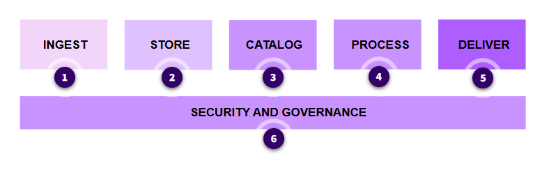

# The Modern Data Architecture
Within organizations, teams often build data solutions in isolation and have their own data ingestion, storage, management, and governance layers.  This leads to delays and increases the cost of data-driven decisions. It also prevents the deeper insights that come when an organization analyzes all their relevant data together.

To avoid these challenges, you must build a modern data architecture for analytics and insights that breaks down all data silos—including third-party data. This architecture creates end-to-end governance and puts the data in the hands of everyone in the organization.

A modern data strategy uses technology building blocks to help you manage, access, analyze, and act on your data. 

The building blocks roughly correspond to a basic workflow. Choose the numbered markers in the following diagram for descriptions of each stage.

## Data Lake

### [**Store Phase**]
Before you can ingest data, you need a place to put it, therefore a modern data architecture starts with the data lake. A data lake is a centralized repository that you can use store structured, semi-structured, and unstructured data at scale. Organizations can use it to ingest, store, and analyze diverse datasets without the need for extensive preprocessing. 

**Amazon S3** provides an optimal foundation for a data lake because of its virtually unlimited scalability and high durability. You can seamlessly and non-disruptively increase storage from gigabytes to petabytes of content and only pay for what you use.

::: tip What is a Silo
Independent data stores that are optimized for specific uses and are difficult to combine or access by other systems
:::

## Specialized ingest services

### [**Ingest Phase**]

#### AWS DMS

Use AWS DMS to load data from relational and non-relational databases.

#### AWS Data Firehose
Ingest real-time data streams with Amazon Data Firehose. Convert your data stream into formats such as Apache Parquet or ORC, decompress the data, or perform custom data transformations.

#### AWS MSK (Managed Streaming for Kafka)
With Amazon MSK, build fully managed Apache Kafka clusters for real-time streaming data pipelines and applications.

#### AWS IoT Core
Connect billions of IoT devices and route trillions of messages to AWS services with AWS IoT Core.

#### AWS DataSync
Use AWS DataSync to transfer data from on-premises file shares, object storage systems, and Hadoop clusters to AWS storage services. Synchronize on a scheduled basis.

#### Transfer Family
Automate file transfers into and out of Amazon S3 using SFTP, FTPS, and SFTP protocols with the Transfer Family.

#### AWS Snow Family
In cases where transfer through a network is not feasible because of data volume or sensitivity, use the AWS Snow Family of purpose-built physical devices.

## Cataloging service

An essential component of a data lake built on Amazon S3 is the data catalog. Organizations can use cataloging to keep track of data assets and understand what data exists, where it is located, its quality, and how it is used. A data catalog is designed to provide a single source of truth about the contents of the data lake. 

### AWS Glue Data
AWS Glue Data Catalog creates a catalog of metadata about your stored assets. Use this catalog to help search and find relevant data sources based on various attributes like name, owner, business terms, and others.

::: tip What is the Data Analytics Workflow
Ingest → Store → Catalog → Process → Deliver
:::

## Processing services
After the data is cataloged, it can now be processed or transformed into formats that are more useful for analysis and insights. Transformation can include data type conversion, filtering, aggregation, standardization, and normalizing.

### Use AWS Glue 
Use AWS Glue, a fully managed extract, transform, and load (ETL) service, to prepare and cleanse data from various sources for analysis. It helps classify data, extract schema, and populate data catalogs.

### Amazon EMR
With Amazon EMR, process big datasets using open-source frameworks, customized Amazon Elastic Compute Cloud (Amazon EC2) clusters, Amazon Elastic Kubernetes Service (Amazon EKS), AWS Outposts, or Amazon EMR Serverless. It can be used to run batch jobs for data processing.

### Amazon Managed Service (Apache Flink)
Quickly author SQL code for real-time data processing using Amazon Managed Service for Apache Flink. Tasks include filtering, aggregating, joining, and deriving.

## Analytics services

Transformed data is delivered to consumers and stakeholders, such as data scientists, data analysts, and business analysts. The primary purpose of data analytics is to extract insights from data that can lead to good business or organizational outcomes. Many AWS services can be used at this stage.

### Amazon Redshift
Amazon Redshift can directly analyze large sets of structured data across many functional databases and datasets without moving the data.

### Athena
Athena queries large datasets directly on Amazon S3 using standard SQL syntax, in various formats such as CSV, Parquet, and ORC.

### Amazon EMR
Use Amazon EMR to run analytics frameworks like Apache Spark, Hive, Presto, and Flink on large datasets stored in AWS services like Amazon S3 and Amazon DynamoDB. Examples include log analysis, machine learning, data science, web indexing and scientific simulations.

### Amazon databases
Use more than fourteen purpose-built Amazon databases to store, query, and analyze large datasets. Choose from relational, key-value, document, in-memory, graph, time series, wide column, and ledger databases.

### OpenSearch
Deploy, operate, and scale OpenSearch clusters in the AWS Cloud. Analyze large volumes of data from various sources like Amazon Kinesis Data Streams, Amazon S3, and Amazon DynamoDB using the OpenSearch APIs.

### Amazon QuickSight
Visualize and analyze large datasets using SQL, charts, graphs, and dashboards with Amazon QuickSight.

### SageMaker
Build, train, and deploy machine learning models for use in predictive analytics, computer vision for image recognition, natural language processing, recommendation systems, and more.

::: tip Why is a Data Catalog Important?
A data catalog acts as a single source of truth for metadata, and tracks data location and quality.
:::

## Security and governance
**Security** in data analytics systems refers to measures taken to protect data from unauthorized access, breaches, or attacks. It involves safeguarding data confidentiality, integrity, and availability. The entire data analytics system depends on data being secured and accessible only by authorized users.
**Governance** encompasses the policies, procedures, and processes that ensure the proper management, quality, and use of data. It involves defining roles, responsibilities, and decision-making processes related to data.
Following are some of the AWS services used for security and governance. These are covered in more detail in this course in the **Security and Monitoring in Data Analytics Systems** lesson.

### Lake Formation
With Lake Formation, you can centrally manage and scale fine-grained data access permissions and share data with confidence within and outside your organization.

### IAM
IAM manages fine-grained access and permissions for human users, software users, other services, and microservices.

### AWS KMS
Use AWS KMS to create and control data encryption keys for data at rest and in transit.

### Macie
Use Macie to automatically discover, classify, and protect sensitive data in AWS, such as personally identifiable information (PII).

### Amazon DataZone
Use Amazon DataZone to catalog, discover, share, and govern data stored across AWS, on premises, and third-party sources.

### Audit Manager
Audit Manager continuously audits usage to assess risk and compliance with regulations and industry standards.